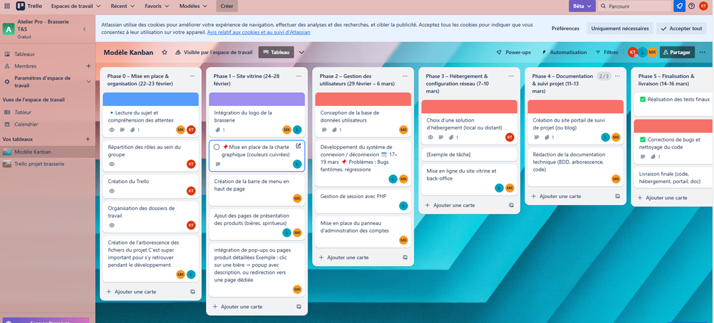
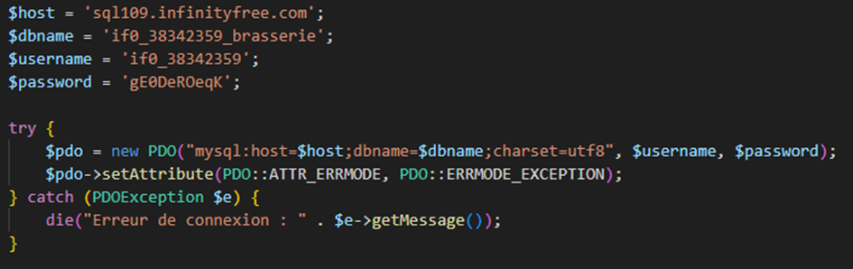
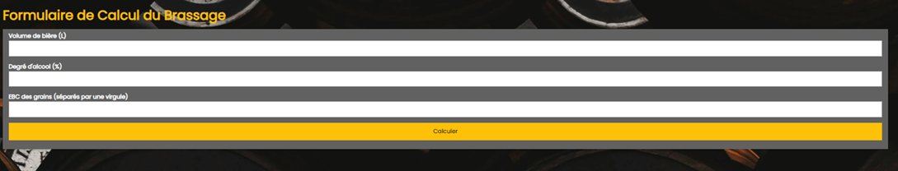
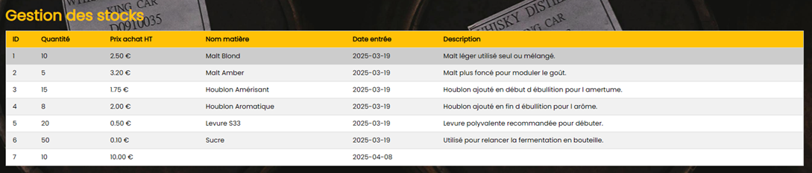
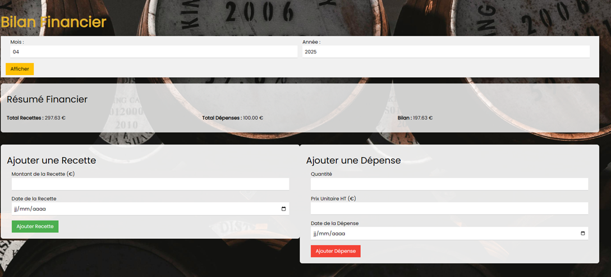
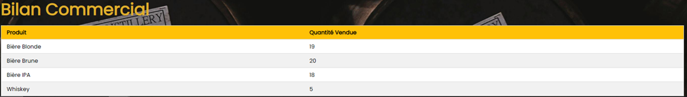
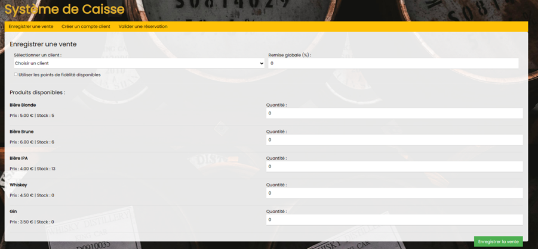
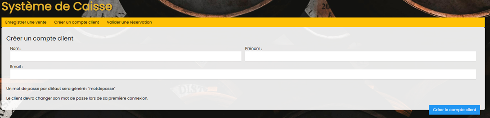
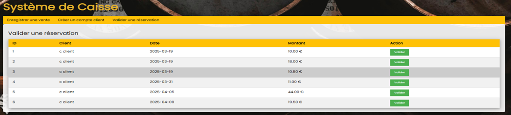
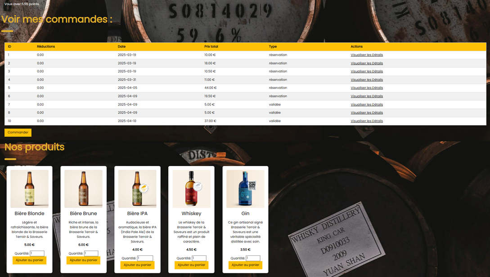

# PROJET SLAM1


Pour le titre de chaque parties, nous allons mettre un code couleur pour différencier le travail de chacun.

**Équipe :**
- Desforges Alexandre (représenté par la couleur bleu)
- Issaoui Khaoula (représentée par la couleur rose)
- Kuras Maxime (représenté par la couleur verte)

## 🔵🟢I) Présentation du projet

Actuellement en première année à l'EPSI nous avions un projet pour l'atelier SLAM1. Nous avions comme projet d'offrir une solution dans le but de développer la présence en ligne à une organisation, ainsi que de lui offrir des outils de gestion adaptés à ses besoins. Cette organisation est La Brasserie Terroir & Saveurs, située dans les Hauts-de-France.

### a) Les missions

Les missions étaient en multiple :

- Voici les principales missions à réaliser pour le projet Brasserie T&S :
- Mise en place d'un outil de suivi et d'hébergement du projet
- Réalisation d'un site vitrine pour la brasserie
- Développement d'un système de gestion des utilisateurs
- Implémentation des fonctionnalités spécifiques pour chaque profil :
  - Brasseur (outils de brassage, gestion des stocks)
  - Direction (bilans financier et commercial)
  - Caissier (système de caisse, gestion des clients)
  - Client (fidélité, achats, réservations)
  - Administrateur (gestion utilisateurs, logs système)
- Production du rendu final avec documentation technique et présentation

###🌸b) Stratégie


La stratégie que nous avons utilisée était la méthode agile. Nous nous donnions souvent de lundi à vendredi pour réaliser les tâches que nous avions prévu le weekend auparavant. Cela nous permettait d'être le plus réactif envers le client (en fonction des évolutions de ses directions). Notre équipe était composé d'une product owner / manageuse et de deux développeurs. Nous avions aussi un tableau Kanban pour visualiser les tâches en cours et leur progression sur Trello.



## 🟢II) Présentation de la structure de données

Nous avons eu des soucis concernant les associations entre les différentes tables sur PHP My Admin cela provient du fait que le type des tables défini par défaut est en "MyISAM" et nous avons modifier le type en "InnoDB".


| **Table catégorie produit** | **Type** | **Description** |
|----------------------------|----------|----------------|
| id | int(11) | Clé primaire |
| nom | varchar(50) | Nom de la catégorie |

| **Table client_fideliter** | **Type** | **Description** |
|---------------------------|----------|----------------|
| id | int(11) | Clé primaire |
| date_fidelisation | date | Date de la fidélisation |
| cagnotte | decimal(10,2) | Montant de la cagnotte |
| id_utilisateur | int(11) | Clé étrangère vers user(id_utilisateur) |

| **Table produits** | **Type** | **Description** |
|-------------------|----------|----------------|
| id | int(11) | Clé primaire |
| nom | varchar(25) | Nom du produit |
| description | varchar(255) | Description du produit |
| prix | decimal(15,2) | Prix du produit |
| url_img | text | URL de l'image du produit |
| etat_produit | tinyint(1) | État actif/inactif |
| stock_produits_finis | varchar(50) | Quantité en stock |
| id_categorie | int(11) | Clé étrangère vers categorie_produit(id) |

| **Table recettes** | **Type** | **Description** |
|-------------------|----------|----------------|
| id | int(11) | Clé primaire |
| volume | decimal(10,2) | Volume de la recette |
| pourcentage | decimal(5,2) | Pourcentage d'alcool |
| ebc_grains | text | Valeur EBC des grains |
| brassage | decimal(10,2) | Quantité pour le brassage |
| rincage | decimal(10,2) | Quantité pour le rinçage |
| MCU | decimal(10,2) | MCU (couleur du moût) |
| EBC | decimal(10,2) | EBC final |
| SRM | decimal(10,2) | SRM final |
| amerisant | decimal(10,2) | Houblon amerisant utilisé |
| aromatique | decimal(10,2) | Houblon aromatique utilisé |
| levure | decimal(10,2) | Quantité de levure |

| **Table role** | **Type** | **Description** |
|---------------|----------|----------------|
| id_role | int(11) | Clé primaire |
| nom_role | varchar(50) | Nom du rôle |
| Description_role | varchar(510) | Description du rôle |

| **Table Stock** | **Type** | **Description** |
|----------------|----------|----------------|
| id_stockmp | int(11) | Clé primaire |
| quantite | int(11) | Quantité en stock |
| prix_achat_ht | decimal(15,2) | Prix d'achat hors taxe |
| nom_matiere | varchar(50) | Nom de la matière première |
| date_entree_stock | date | Date d'entrée en stock |
| description_mp | text | Description de la matière première |

| **Table user** | **Type** | **Description** |
|---------------|----------|----------------|
| id_utilisateur | int(11) | Clé primaire |
| nom | varchar(20) | Nom de l'utilisateur |
| prenom | varchar(20) | Prénom de l'utilisateur |
| email | varchar(50) | Adresse e-mail |
| creer_le | timestamp | Date de création |
| etat_compte | tinyint(1) | État du compte |
| premiere_co | tinyint(1) | Statut première connexion |
| login | varchar(15) | Identifiant |
| password | varchar(255) | Mot de passe (hashé) |
| id_role | int(11) | Clé étrangère vers role(id_role) |

| **Table vente** | **Type** | **Description** |
|----------------|----------|----------------|
| id_vente | int(11) | Clé primaire |
| reductions | decimal(15,2) | Montant de la réduction appliquée |
| date_vente | date | Date de la vente |
| total | decimal(15,2) | Montant total de la vente |
| type_vente | varchar(50) | Type (ex. réservation, achat, etc.) |
| id_utilisateur | int(11) | Clé étrangère vers user(id_utilisateur) |

| **Ventes_details** | **Type** | **Description** |
|-------------------|----------|----------------|
| id_produit | int(11) | Clé étrangère vers produits(id) |
| id_vente | int(11) | Clé étrangère vers ventes(id_vente) |
| quantite | int(11) | Quantité du produit vendu |
| prix_unitaire | decimal(15,2) | Prix unitaire (non défini dans le CREATE, mais présent dans les données) |

Initialement, notre projet reposait sur une base de données existante. Cependant, cette dernière présentait de nombreuses limites, notamment en matière de gestion des ventes, de flexibilité des rôles utilisateurs et d'évolutivité. Nous avons donc choisi de repartir sur une base propre, entièrement repensée.

Structure de la base de données :

- **user** : Table centrale contenant les informations des utilisateurs.
- **role** : Permet d'attribuer un rôle à chaque utilisateur, déterminant ses droits d'accès aux fonctionnalités de la plateforme (ex. : administrateur, direction, brasseur, caissier, client).
- **client_fideliter** : Enregistre les points de fidélité des clients (rôle n°4) pour un futur système de récompenses.

Gestion des ventes :

- **ventes** : Permet l'enregistrement des ventes, avec des fonctionnalités adaptées aux profils *caissier* (vente directe, gestion des réductions) et *direction* (consultation des chiffres, ajout de dépenses).
- **ventes_details** : Table de liaison entre les ventes et les produits, précisant les quantités et prix unitaires, afin de suivre précisément les transactions.

Produits et affichage :

- **produit** : Utilisée par :
  - le *caissier* pour la vente de produits,
  - le *brasseur* pour la création ou modification des produits,
  - la *vitrine* du site pour l'affichage des produits, avec gestion des images (via url_image).

Fonctionnalités évolutives :

Pour anticiper les besoins futurs ou permettre des extensions de fonctionnalités, d'autres tables ont été prévues :

- **categorie_produit** : Organisation des produits par catégorie.
- **fournisseurs** : Gestion des fournisseurs de matières premières.
- **achats** : Historique des achats effectués auprès des fournisseurs.
- **stock_matière_première** : Suivi du stock des ingrédients nécessaires à la production.
- **brassage** : Traçabilité de la production brassicole, étape par étape.

Cette base de données assure donc une gestion complète, centralisée et évolutive de l'ensemble des besoins de la brasserie, tant au niveau de la vente que de la production ou de la gestion client.

## III) Présentation de la structure du programme

### 🔵Arborescence :

```
/
├── admin.php
├── bar.jpg
├── blonde.png
├── brasserie_logo.png
├── brasseur.php
├── brune.png
├── caissier.css
├── caissier.php
├── changement_mdp.php
├── client.php
├── config.php
├── connexion.php
├── dashboard_direction.php
├── direction.php
├── gin.png
├── index.php
├── inscri.php
├── inscription.php
├── ipa.png
├── log.php
├── login.php
├── logout.php
├── logs.txt
├── panier.php
├── produits.php
├── whiskey.png
```

### Fonctions/fonctionnalité récurrente :


Fonction permettant d'ajouter un message de type évènement dans un fichier log.txt (exemple : [2025-04-09 09:54:33] Tentative de connexion par un utilisateur)



Connexion à la base de données avec gestion d'erreur.

### 🔵a) Connexion

(L 122-132)

Formulaire permettant de se connecter avec les bons types et aussi le required qui oblige l'insertion d'une valeur dans l'entrée utilisateur

(L 10)

Vérification des saisies utilisateur côté serveur.
(L 21-48)

On récupère les informations de l'utilisateur grâce à son login et on vérifie avec la similitude du mot de passe enregistré haché dans la bdd et l'entrée utilisateur

Si tout est bon, on attribue à cette session des données qui nous seront utiles sur toutes les autres pages comme l'id, le role ainsi que son login.

On récupère la valeur dans la bdd qui nous indique si c'est ça première connexion alors qu'il doit changer de mot de passe (lors de la création d'un compte, le mot de passe est automatiquement "motdepasse" et l'utilisateur doit le changer lors de sa première connexion). Il sera donc redirigé vers une page qui lui permettra de changer son mot de passe sinon il pourra accéder à son profil.

### 🔵b) Changement mot de passe
(L 126-135)

Formulaire permettant d'entrée son nouveau mot de passe. Deux fois entrée pour plus de sécurité

(L 29-47)

On vérifie l'entrée du formulaire puis on vérifie la similitude entre les deux mots de passes et si oui alors on met à jour la base de données avec le nouveau mot de passe haché et on le redirige vers l'index et on n'oublie pas de modifier aussi l'état de sa première connexion pour ses prochains venus sur le site.

### 🔵c) Admin

(L 27-50)

Ici on update la base de données en changeant les infos que l'admin aura indiqué dans le form et on se referera à l'id utilisateur pour changer le compte utilisateur de quelqu'un

(L 52-91)

Ici on va ajouter un utilisateur à la base de donnée en prenant comme login premiere lettre du prénom + nom de famille+25, on va hacher le mot de passe via la fonction php, et aussi on verifie que le login n'existe pas déjà dans la bdd (unicité)

(L 91-98)

Ici on va venir supprimer un utilisateur via son id.

(L 238-269)

On aura ici un tableau affichant les colonnes pour chaque utilisateur avec des actions de sois modifié l'utilisateur ou soit le supprimer

(L 273-286)

Ici on va afficher un form quand l'utilisateur cliquera sur le bouton ajouter utilisateur qui envoyer en post les infos

### 🔵d) Brasseur

(L 52-55)(L 65-67)

Requêtes permettant de récupérer la table produits et recettes

(L 70-91)
Ici on récupère les infos entrées par le brasseur et on applique les calculs recommandés par Mr. Lecomte pour ensuite l'afficher au brasseur les ingrédients de sa recette.

(L 91-115)
On va venir enregistrer dans la bdd la recette créer par le brasseur si celui-ci clique sur enregistrer la recette.

(L 374-390)

Il s'agit du formulaire pour que le brasseur ait une recette.

(L 282-310)
On va afficher les produits avec leurs caractéristiques

(L 396-408)

On va afficher les résultats du calcul du brasseur et lui proposer l'option de l'enregistrer

(L 436-471)

Affichage des recettes

(L 378-501)

Affichage du stock des matières premières.

### 🔵e) Client

(L 24-67)

On va récupérer depuis le form l'id du produit ainsi que sa quantité puis on rentrera le tout dans la variable $_SESSION['PANIER'] en vérifiant qu'il existe bien et que le produit sélectionné n'est pas déjà dans le panier auquel cas on rajoute sa nouvelle quantité.

(L 69-74)

Ici on va pouvoir récupérer les points de fideliter du client ainsi que ses ventes et on pourra sélectionner les détails des ventes en fonction alors de l'id de la vente.

(L 90-100)

On sélectionne les produits disponibles, alors ou leur état = 1 lorsque le client clique sur commander.

(L 241-250)

Affichage points de fidélité

(L 252-286)

Affichage des commandes avec une colonne action permettant de visualiser les détails de la commande

(L 286-315)

Affichage des détails de la vente en fonction de l'id de la vente sélectionnée.

(L 325-338)

Affichage des produits disponibles avec possibilité de commander et l'id, et la quantité passeront dans le form.


!
## IV) Présentation des fonctionnalités du programme

### 🟢🔵A) Site Vitrine

Nous retrouvons sur le site vitrine, un message de bienvenue, les produits que l'on présente et qui sommes-nous.

Nous avons la navbar sur la gauche avec le logo et un message explicitant le rôle avec lequel on se connecte, en dessous de celle-ci, plusieurs onglets de navigation ; "Accueil, Nos Produits, Qui Nous Sommes, l'onglet du rôle et le bouton déconnexion".


### 🔵B) Système de Connexion

Pour ce qui est du système de connexion, nous avons un simple formulaire qui renvoie au serveur mot de passe et login, une vérification est faite par la base de données et la page qui est associé à notre rôle sera déployée. 


### 🔵C) Administration des Comptes (Profil Administrateur)

Pour ce qui est de la page administrateurs, nous avons bien les fonctionnalités de gestions des différents utilisateurs, la possibilité de modifier, supprimer ou ajouter des comptes. Seul l'administrateur peut créer des comptes ayant un rôle autre que client. Nous avons donc le tableau qui renvoie l'ensemble des utilisateurs de la base de données, et à droite des actions permettant de supprimer ou modifier les comptes.

En bas se trouve l'onglet d'ajout d'utilisateur avec un simple formulaire renvoyant ; "Nom, Prénom, E-mail, Rôle, Etat du compte". L'ajout du rôle et de l'état du compte est unique à l'interface administrateur.


### 🔵D) Espace brasseur

Le profil brasseur nous permet de gérer le stock de bières présent, il peut modifier ou supprimer du stock.

Il a également le formulaire de calcul du brassage, il rentre les valeurs souhaiter pour créer une bière en particulier et la formule lui permet de connaître les dosages exacts. La bière créer avec la formule peut être ajouter avec le formulaire d'ajout de produit.

La recette de bière est ainsi créée et enregistrée en base de données.




Il a également la possibilité de voir le stock de matière premières à savoir s'il a la possibilité de produire la bière souhaitée.



### 🟢E) Espace Direction

Le profil Direction a deux grosses fonctionnalités principales, la possibilité de gérer le bilan financier, avec un filtre par mois et années. Le bilan est donc dû au calcul suivant : Total recettes -- Total Dépenses.

Il a également la possibilité d'ajouter une recette (ex : vente de produit pour une autre entreprise) et d'ajouter une dépense (ex : achat de matières premières chez un fournisseur).



La seconde fonctionnalité majeure est le bilan commercial qui n'est ni plus ni moins que l'ensemble des produits vendus à un moment donné, en l'occurrence le mois d'avril 2025.



### 🟢F) Espace Caissier

Le profil caissier possède 3 grandes fonctionnalités qui sont ; "L'enregistrement d'une vente à un client, Créer un compte client et Valider une réservation"

La première permet de vendre grâce à un formulaire, les différents produits proposés par la brasserie mais également il lui permet de sélectionner un client s'il a déjà un compte chez nous et y mettre une remise en pourcentage.



Dans le cas où le client n'a pas de compte, la seconde fonctionnalité prends son sens, le caissier peut en créer un avec un formulaire, qui, contrairement au profil administrateur, n'a que les champs nom, prénom et e-mail. Le rôle et l'état du compte sera automatiquement gérer dans le code.



La dernière fonctionnalité est la réservation. Sachant que le profil client peut passer une réservation, le profil caissier peut valider celle-ci.



### 🔵G) Espace Client

Pour le dernier profil, le client a la possibilité de visualiser l'ensemble des commandes qu'il a effectué. Mais également de passer commande, d'où l'importance de la fonctionnalité du profil caissier.



## V) Démonstration d'un exemple de fonctionnement (vidéo)

[Lien vers la vidéo de démonstration](https://youtu.be/uNSb7ul4Q2I)

## VI) Vidéo de présentation sur ce que vous avez réalisé (que vous aviez en charge)

[Lien vers la vidéo de présentation de nos parties individuelles](https://www.youtube.com/watch?v=Iv5gFbdfd-k&ab_channel=AlexandreDesforges)

## VII) Sources

- W3C (Doc générale)
- PHP (Site de la doc PHP)
- MDN Web Docs (Site de la doc HTML)
- W3Schools (Site de la doc CSS)
- Looping (MCD et MLD de la BDD)
- ChatGPT, Claude, Copilot
- StackOverflow
